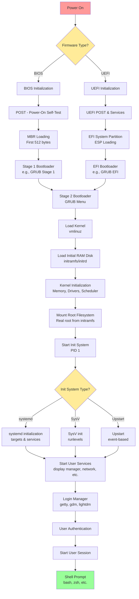

# The Boot Procedure: From Firmware to Shell

## Overview

The boot process is a complex sequence of events that transforms a powered-off computer into a running system with a user shell. This document explains each stage from the firmware initialization to the shell prompt.

---

## High-Level Boot Flow Diagram



---

## Detailed Boot Stages

### 1. Power-On and Firmware Initialization

#### 1.1 Power Supply Unit (PSU)
- Computer is powered on
- PSU provides stable power to motherboard
- Reset signal is released, CPU starts executing

#### 1.2 Firmware Loading (BIOS vs UEFI)

##### **BIOS (Basic Input/Output System)**
- **Location**: Stored in ROM/Flash memory on motherboard
- **Architecture**: 16-bit real mode
- **Boot Method**: MBR (Master Boot Record)
- **Limitations**: 
  - Limited to 2TB disk size
  - No secure boot
  - Slower initialization
  - Text-based interface

##### **UEFI (Unified Extensible Firmware Interface)**
- **Location**: Stored in flash memory, can be on multiple locations
- **Architecture**: 32-bit or 64-bit protected mode
- **Boot Method**: GPT (GUID Partition Table) + EFI System Partition
- **Advantages**:
  - Supports disks larger than 2TB
  - Secure Boot capability
  - Faster boot times
  - Graphical interface support
  - Network boot capabilities
  - Modular architecture

---

### 2. POST (Power-On Self-Test)

Both BIOS and UEFI perform POST to verify hardware:

```
┌─────────────────────────────────────────┐
│          POST Checklist                 │
├─────────────────────────────────────────┤
│ ✓ CPU verification                      │
│ ✓ Memory (RAM) test                     │
│ ✓ Keyboard detection                    │
│ ✓ Storage devices detection             │
│ ✓ Graphics card initialization          │
│ ✓ Other peripherals                     │
└─────────────────────────────────────────┘
```

**Output**: Beep codes or on-screen messages indicate status
- **Success**: Single beep (typically)
- **Failure**: Multiple beeps indicate specific hardware problems

---

### 3. Boot Device Selection

#### BIOS Boot Process
1. **Read Boot Order**: Check CMOS settings for boot device priority
2. **MBR Loading**: 
   - Load first 512 bytes from boot device
   - Last 2 bytes must be `0x55AA` (boot signature)
   - MBR contains:
     - 446 bytes: Bootstrap code
     - 64 bytes: Partition table (4 partitions × 16 bytes)
     - 2 bytes: Boot signature

#### UEFI Boot Process
1. **Read Boot Configuration**: Check NVRAM for boot entries
2. **ESP (EFI System Partition) Access**:
   - FAT32 formatted partition
   - Contains bootloader files (.efi)
   - Standard location: `/EFI/BOOT/BOOTX64.EFI` (x86_64)

---

### 4. Bootloader Execution

Common bootloaders: **GRUB2** (most common), **systemd-boot**, **LILO** (legacy), **rEFInd**

#### GRUB2 (GRand Unified Bootloader 2)

##### Stage 1 (BIOS mode)
- **Size**: 446 bytes in MBR
- **Function**: Load Stage 1.5 or Stage 2
- **Location**: First sector of boot drive

##### Stage 1.5 (BIOS mode, optional)
- **Location**: Between MBR and first partition (usually ~32KB)
- **Function**: Contains filesystem drivers
- **Purpose**: Bridge gap to load Stage 2 from filesystem

##### Stage 2 (Both BIOS and UEFI)
- **Location**: `/boot/grub/` directory
- **Functions**:
  - Display boot menu
  - Load configuration (`grub.cfg`)
  - Accept user input
  - Load kernel and initramfs
  - Pass kernel parameters

#### GRUB Menu Example
```
GNU GRUB version 2.06

┌────────────────────────────────────────────────┐
│ Ubuntu                                         │
│ Ubuntu (recovery mode)                         │
│ Advanced options for Ubuntu                    │
│ Windows Boot Manager (on /dev/nvme0n1p1)      │
│                                                │
└────────────────────────────────────────────────┘

Use ↑ and ↓ to select, 'e' to edit, 'c' for command-line
```

---

### 5. Kernel Loading

#### Kernel Image Loading
- **File**: `/boot/vmlinuz-<version>` (compressed kernel)
- **Process**:
  1. Bootloader decompresses kernel into memory
  2. Kernel is loaded at specific memory address
  3. Kernel parameters passed from bootloader

#### Common Kernel Parameters
```bash
# Example from /boot/grub/grub.cfg
linux /boot/vmlinuz-5.15.0-generic \
    root=UUID=xxxx-xxxx-xxxx-xxxx \
    ro quiet splash \
    init=/lib/systemd/systemd
```

**Parameter meanings**:
- `root=`: Root filesystem location
- `ro`: Mount root as read-only initially
- `quiet`: Suppress verbose messages
- `splash`: Show splash screen
- `init=`: Specify init system path

---

### 6. Initial RAM Disk (initramfs/initrd)

#### Purpose
Temporary root filesystem that contains:
- Essential drivers (disk, filesystem, network)
- Utilities for mounting real root filesystem
- Scripts for hardware detection and module loading

#### Process
```
┌──────────────────────────────────────────────────┐
│  1. Load initramfs into RAM                      │
│     - File: /boot/initramfs-<version>.img        │
│     - Compressed cpio archive                    │
├──────────────────────────────────────────────────┤
│  2. Extract and mount as temporary root (/)      │
│     - tmpfs filesystem in RAM                    │
├──────────────────────────────────────────────────┤
│  3. Execute /init script                         │
│     - Load necessary kernel modules              │
│     - Detect and initialize hardware             │
│     - Mount real root filesystem                 │
├──────────────────────────────────────────────────┤
│  4. Switch to real root filesystem               │
│     - Use pivot_root or switch_root              │
│     - Continue boot process                      │
└──────────────────────────────────────────────────┘
```

#### Why initramfs?
- Kernel can't contain all possible drivers (too large)
- Allows modular approach to hardware support
- Enables encrypted root filesystem support
- Supports LVM, RAID, network boot scenarios

---

### 7. Kernel Initialization

#### Kernel Initialization Sequence

```
Kernel startup (start_kernel function)
│
├─► Memory Management Setup
│   ├─ Initialize paging
│   ├─ Set up memory zones
│   └─ Initialize slab allocator
│
├─► Scheduler Initialization
│   ├─ Create idle task (PID 0)
│   └─ Set up scheduling classes
│
├─► Interrupt Handling Setup
│   ├─ Initialize IDT (Interrupt Descriptor Table)
│   └─ Register interrupt handlers
│
├─► Device Driver Initialization
│   ├─ Built-in drivers
│   ├─ Load modules from initramfs
│   └─ Detect and configure hardware
│
├─► Filesystem Registration
│   ├─ Register VFS (Virtual File System)
│   └─ Mount rootfs
│
└─► Start init process (PID 1)
    └─ Execute /sbin/init or specified init
```

#### Kernel Messages
Visible in `dmesg` or `/var/log/kern.log`:
```
[    0.000000] Linux version 5.15.0-generic
[    0.001234] Command line: root=UUID=xxx ro quiet splash
[    0.123456] Memory: 16GB available
[    0.234567] ACPI: Initialized
[    1.234567] PCI: Probing PCI hardware
[    2.345678] EXT4-fs: mounted filesystem with ordered data mode
```

---

### 8. Init System (PID 1)

The init system is the first user-space process with PID 1, responsible for starting all other processes.

#### 8.1 systemd (Modern Systems)

**Architecture**:
```
systemd (PID 1)
│
├─► Targets (similar to runlevels)
│   ├─ basic.target
│   ├─ multi-user.target
│   └─ graphical.target
│
├─► Units
│   ├─ Services (.service)
│   ├─ Sockets (.socket)
│   ├─ Devices (.device)
│   ├─ Mounts (.mount)
│   └─ Timers (.timer)
│
└─► Dependencies & Parallelization
    ├─ Requires=
    ├─ Wants=
    ├─ After=
    └─ Before=
```

**Boot Targets**:
- `rescue.target`: Single-user mode (minimal services)
- `multi-user.target`: Multi-user text mode
- `graphical.target`: Multi-user with GUI

**Key systemd Commands**:
```bash
# View boot time analysis
systemd-analyze
systemd-analyze blame
systemd-analyze critical-chain

# Check target
systemctl get-default
systemctl set-default graphical.target

# List services
systemctl list-units --type=service
```

#### 8.2 SysV Init (Legacy Systems)

**Runlevels**:
```
0 - Halt/Shutdown
1 - Single user mode
2 - Multi-user mode without networking
3 - Multi-user mode with networking
4 - Unused/Custom
5 - Multi-user mode with GUI
6 - Reboot
```

**Process**:
1. Read `/etc/inittab`
2. Execute scripts in `/etc/rc.d/rc<N>.d/`
3. Scripts prefixed with S (Start) or K (Kill)
4. Sequential execution (slower than systemd)

#### 8.3 Upstart (Ubuntu legacy, now deprecated)

- Event-driven init system
- Used on Ubuntu before switching to systemd
- Configuration in `/etc/init/`

---

### 9. System Service Initialization

#### Essential Services Started

```
Init System (systemd example)
│
├─► Basic Services
│   ├─ udev (device manager)
│   ├─ journald (logging)
│   ├─ networkd/NetworkManager
│   └─ dbus (interprocess communication)
│
├─► Filesystem Services
│   ├─ Mount all filesystems (/etc/fstab)
│   ├─ fsck (filesystem check if needed)
│   └─ Swap activation
│
├─► Network Services
│   ├─ Network interface configuration
│   ├─ DHCP client
│   └─ DNS resolver
│
├─► System Services
│   ├─ cron (scheduled tasks)
│   ├─ syslog (system logging)
│   ├─ ssh (remote access)
│   └─ Other daemons
│
└─► User Services
    ├─ Display manager (gdm, lightdm, sddm)
    ├─ Desktop environment services
    └─ User session management
```

---

### 10. Login Manager and User Session

#### 10.1 Text Mode Login (getty)

**Process**:
1. `agetty` or `getty` started on virtual terminals (tty1-tty6)
2. Displays login prompt
3. Waits for username input
4. Passes to `login` program for authentication

**Configuration**:
```bash
# systemd service for getty
/lib/systemd/system/getty@.service

# Virtual terminal
# Press Ctrl+Alt+F1 to F6 for different ttys
```

#### 10.2 Graphical Login (Display Manager)

Common display managers:
- **GDM** (GNOME Display Manager)
- **LightDM** (lightweight)
- **SDDM** (KDE)
- **XDM** (classic X Display Manager)

**Process**:
1. Display manager starts X server or Wayland compositor
2. Shows graphical login screen
3. Authenticates user (PAM - Pluggable Authentication Modules)
4. Starts desktop session

#### 10.3 Authentication Flow

```
Login Request
│
├─► PAM (Pluggable Authentication Modules)
│   ├─ /etc/pam.d/login
│   ├─ /etc/pam.d/gdm
│   └─ /etc/pam.d/common-*
│
├─► Check Credentials
│   ├─ /etc/passwd (user info)
│   ├─ /etc/shadow (encrypted passwords)
│   └─ /etc/group (group memberships)
│
├─► Session Setup
│   ├─ Set environment variables
│   ├─ Create session directories
│   ├─ Mount home directory
│   └─ Apply resource limits
│
└─► Start User Shell or Desktop
```

---

### 11. Shell Initialization

#### 11.1 Shell Startup Process

When a user logs in, the shell initialization process begins:

##### Login Shell (after login)
1. **System-wide configuration**:
   - `/etc/profile` - System-wide profile
   - `/etc/profile.d/*.sh` - Additional scripts

2. **User-specific configuration** (bash example):
   - `~/.bash_profile` (or `~/.bash_login` or `~/.profile`)
   - If not found, falls back to `~/.bashrc`

##### Non-Login Shell (terminal in GUI)
- Reads `~/.bashrc` directly

##### Example .bash_profile
```bash
# Load .bashrc if it exists
if [ -f ~/.bashrc ]; then
    source ~/.bashrc
fi

# User-specific environment variables
export PATH="$HOME/bin:$PATH"
export EDITOR=vim
```

##### Example .bashrc
```bash
# Prompt configuration
PS1='\u@\h:\w\$ '

# Aliases
alias ll='ls -la'
alias grep='grep --color=auto'

# History settings
HISTSIZE=1000
HISTFILESIZE=2000
```

#### 11.2 Shell Types

```
┌──────────────────────────────────────────────┐
│ Common Shells                                │
├──────────────────────────────────────────────┤
│ bash    - Bourne Again Shell (most common)  │
│ zsh     - Z Shell (feature-rich)             │
│ fish    - Friendly Interactive Shell         │
│ sh      - Bourne Shell (POSIX)               │
│ ksh     - Korn Shell                         │
│ tcsh    - Enhanced C Shell                   │
└──────────────────────────────────────────────┘
```

#### 11.3 Shell Features Ready

After initialization, the shell provides:
- Command execution
- Job control (background/foreground processes)
- Command history
- Tab completion
- Environment variables
- Aliases and functions
- Script execution capability

---

## Complete Boot Timeline

### Typical Boot Times

```
UEFI/BIOS Firmware: 2-5 seconds
POST:               1-3 seconds
Bootloader:         0.5-2 seconds
Kernel Loading:     1-2 seconds
Kernel Init:        2-4 seconds
Init System:        3-8 seconds
Services:           5-15 seconds
Login Ready:        1-2 seconds
─────────────────────────────────
Total:              15-40 seconds (typical)
```

### Detailed Timeline Example (systemd)

```
[    0.000s] → Firmware Start
[    2.345s] → Bootloader (GRUB)
[    2.890s] → Kernel Start
[    3.123s] → Kernel Initialization Complete
[    3.456s] → systemd Start (PID 1)
[    3.678s] → basic.target reached
[    5.234s] → network.target reached
[    7.890s] → multi-user.target reached
[    9.123s] → graphical.target reached
[    9.567s] → Display Manager Ready
[   10.123s] → Login Prompt Displayed
```

---

## Boot Process Comparison: BIOS vs UEFI

| Feature | BIOS | UEFI |
|---------|------|------|
| **Architecture** | 16-bit real mode | 32/64-bit protected mode |
| **Boot Method** | MBR (Master Boot Record) | GPT + ESP partition |
| **Disk Size Limit** | 2TB | 9.4 ZB (theoretical) |
| **Partition Limit** | 4 primary partitions | 128 partitions (typical) |
| **Boot Speed** | Slower | Faster |
| **Secure Boot** | No | Yes |
| **Network Boot** | Limited (PXE) | Native support |
| **Interface** | Text-based | Graphical possible |
| **Pre-OS Environment** | Limited | Rich (UEFI Shell, apps) |

---

## Troubleshooting Boot Issues

### Common Boot Problems and Solutions

#### 1. No Boot Device Found
```
Possible Causes:
• Hard drive not detected
• Boot order incorrect
• MBR/GPT corrupted

Solutions:
• Check BIOS/UEFI boot order
• Verify drive connections
• Boot from live USB and repair boot
```

#### 2. GRUB Rescue Prompt
```bash
# Find correct partition
grub rescue> ls
grub rescue> ls (hd0,msdos1)/boot/grub

# Set correct root and boot
grub rescue> set root=(hd0,msdos1)
grub rescue> set prefix=(hd0,msdos1)/boot/grub
grub rescue> insmod normal
grub rescue> normal

# After booting, reinstall GRUB
sudo grub-install /dev/sda
sudo update-grub
```

#### 3. Kernel Panic
```
Common Causes:
• Corrupted initramfs
• Missing drivers
• Hardware failure
• Root filesystem issues

Recovery:
• Boot with older kernel (GRUB menu)
• Use recovery mode
• Regenerate initramfs
```

#### 4. System Hangs During Boot
```bash
# Boot with systemd debug
# Add to kernel parameters:
systemd.log_level=debug systemd.log_target=console

# Check what service is hanging
systemctl list-jobs
systemctl status <service-name>
```

---

## Useful Commands for Boot Analysis

### View Boot Messages
```bash
# Kernel ring buffer
dmesg | less

# System log
journalctl -b           # Current boot
journalctl -b -1        # Previous boot
journalctl -b -2        # Two boots ago

# Boot time analysis (systemd)
systemd-analyze
systemd-analyze blame
systemd-analyze critical-chain
```

### Boot Configuration Files
```bash
# GRUB configuration
/boot/grub/grub.cfg           # Generated config
/etc/default/grub             # User settings
/etc/grub.d/                  # Config scripts

# systemd
/etc/systemd/system/          # System units
/usr/lib/systemd/system/      # Package units
systemctl get-default         # Default target

# Kernel parameters
cat /proc/cmdline

# Firmware type
ls /sys/firmware/efi          # Exists = UEFI
                              # Not exists = BIOS
```

---

## Key Takeaways

1. **Firmware** (BIOS/UEFI) initializes hardware and loads bootloader
2. **Bootloader** (GRUB) loads kernel and initramfs into memory
3. **Kernel** initializes core system and hardware drivers
4. **initramfs** provides temporary root with essential drivers
5. **Init system** (systemd/SysV) starts all system services
6. **Login manager** authenticates users and starts sessions
7. **Shell** provides user interface for system interaction

The entire process transforms bare hardware into a fully functional operating system ready for user interaction, typically completing in 15-40 seconds on modern systems.

---

## References and Further Reading

- [Linux Boot Process Documentation](https://www.kernel.org/doc/html/latest/admin-guide/initrd.html)
- [systemd Boot Process](https://www.freedesktop.org/software/systemd/man/bootup.html)
- [UEFI Specification](https://uefi.org/specifications)
- [GRUB Manual](https://www.gnu.org/software/grub/manual/)
- The Linux Kernel Documentation: `Documentation/x86/boot.txt`

---

**Last Updated**: January 2, 2026
