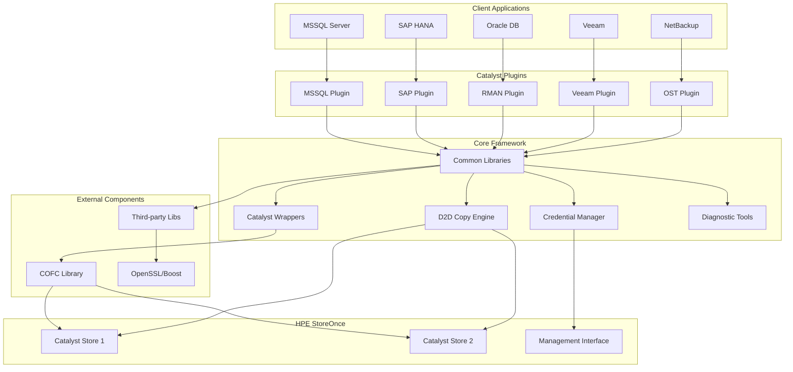

# HPE StoreOnce Catalyst Plugins - Developer Onboarding Guide

## 1. Project Overview

### Purpose and Main Features
The **HPE StoreOnce Catalyst Plugins** repository is a comprehensive software project designed to provide backup and data management capabilities for various enterprise applications through HPE StoreOnce Catalyst technology. This multi-platform codebase supports integration with major enterprise backup solutions and databases.

**Key Capabilities:**
- Cross-platform backup plugin development for enterprise applications
- HPE StoreOnce Catalyst integration for deduplication and data management
- Support for multiple databases and backup applications
- Secure credential management and authentication
- Data-to-data copy operations and lifecycle management

### Technology Stack
- **Primary Languages**: C++, C, Groovy, Python, JavaScript
- **Build System**: Gradle 3.3 with custom native toolchain support
- **Platforms**: Linux (RHEL, CentOS, SUSE), Windows, UNIX (Solaris, HP-UX, AIX)
- **Compilers**: GCC, Visual C++, HP aCC, Sun Studio, IBM XLC
- **Libraries**: Boost, OpenSSL, LZO2, Jansson (JSON), CPPUnit
- **Testing**: CPPUnit framework for C++ unit testing
- **Documentation**: Markdown, ReStructuredText

### Project Type
Enterprise backup plugin suite with multi-platform native library components, web applications, and command-line utilities.

### Target Audience
- **Enterprise IT administrators** managing backup infrastructure
- **Database administrators** (SAP HANA, Oracle, SQL Server)
- **Backup application vendors** integrating with HPE StoreOnce
- **System integrators** deploying enterprise backup solutions

## 2. Architecture Analysis

### System Architecture
The project follows a **modular plugin architecture** with the following key characteristics:

- **Plugin-based Design**: Each supported application (MSSQL, SAP HANA, Oracle, etc.) has its own plugin module
- **Shared Common Libraries**: Core functionality is abstracted into reusable libraries
- **Multi-platform Support**: Platform-specific toolchains and build configurations
- **External Dependencies**: Integration with HPE StoreOnce Catalyst APIs and third-party libraries

### Module Breakdown

#### Core Plugin Modules (`isvsupport/`)
```
isvsupport/
├── d2dcopy/          # Data-to-data copy operations
├── mssql/            # Microsoft SQL Server plugin  
├── sap/              # SAP applications (HANA, Oracle)
├── ost/              # OpenStorage plugin for NetBackup
├── rman/             # Oracle RMAN plugin
├── veeam/            # Veeam backup integration
├── rmc/              # Remote Management Console
├── common/           # Shared utilities and libraries
├── wrappers/         # Language wrappers (Python, C++)
├── ca/               # Certificate Authority integration
├── catalystcredentials/  # Credential management
└── catalystdiagnostic/   # Diagnostic utilities
```

#### Build Infrastructure (`buildSrc/`)
- **Custom Gradle Plugins**: Native compilation support for multiple toolchains
- **Toolchain Abstractions**: HP aCC, Sun CC, IBM XLC, Visual C++ support
- **External Build Integration**: CMake and GNU Make integration
- **Testing Framework**: CPPUnit integration and test execution

#### External Dependencies (`external/`)
- **COFC**: HPE StoreOnce Catalyst Object File Client
- **Third-party Libraries**: OpenSSL, Boost, curl, zlib, lzo

### Data Flow
1. **Plugin Configuration**: Each plugin reads configuration from `plugin.conf` files
2. **Credential Management**: Secure credential storage via `CatalystCredentials`
3. **Catalyst API Integration**: Native C++ wrappers communicate with StoreOnce systems
4. **Data Operations**: Backup, restore, copy, and lifecycle management operations
5. **Logging and Diagnostics**: Centralized logging and diagnostic capabilities

### Key Design Patterns
- **Factory Pattern**: Plugin instantiation and toolchain selection
- **Strategy Pattern**: Platform-specific compilation and linking strategies
- **Adapter Pattern**: Database-specific backup API adaptations
- **Command Pattern**: Backup operation execution and management

## 3. Technical Deep Dive

### Important Classes and Functions

#### Core Catalyst Integration
- **`CatalystSession`**: Main session management class for StoreOnce connections
- **`D2DCopyInterface`**: Data-to-data copy operations interface
- **`ObjectStore`**: StoreOnce object store management
- **`CommandSession`**: Catalyst command execution session

#### Plugin Architecture
- **`PluginBase`**: Base class for all backup plugins
- **`ConfigurationManager`**: Configuration file parsing and management
- **`CredentialManager`**: Secure credential storage and retrieval
- **`DiagnosticCollector`**: System diagnostics and troubleshooting

#### Build System Components
- **`ExternalNativeComponentSpec`**: External build integration specification
- **`AccToolchain`**: HP aCC compiler toolchain implementation
- **`XlcToolchain`**: IBM XLC compiler toolchain implementation
- **`CppUnitPlugin`**: CPPUnit testing framework integration

### Data Structures
- **Configuration Maps**: Key-value pairs for plugin settings
- **Credential Stores**: Encrypted password storage structures
- **Session Contexts**: Active backup session state management
- **Binary Specifications**: Native library build configurations

### Key Algorithms
- **Credential Encryption**: AES-based password encryption for secure storage
- **Data Deduplication**: Integration with StoreOnce deduplication algorithms
- **Multi-platform Compilation**: Dynamic toolchain selection and configuration
- **Dependency Resolution**: Gradle-based dependency graph resolution

### Configuration
- **Global Settings**: `gradle.properties`, `settings.gradle`
- **Plugin Configurations**: Individual `plugin.conf` files per module
- **Build Configurations**: Platform-specific `build.gradle` files
- **Toolchain Configurations**: Compiler-specific settings and flags

## 4. External Dependencies

### Third-party Libraries
- **Boost C++ Libraries**: Utility libraries for enhanced C++ functionality
- **OpenSSL**: Cryptographic operations and secure communications
- **LZO2**: High-speed compression library
- **Jansson**: JSON parsing and generation library
- **CPPUnit**: C++ unit testing framework
- **curl**: HTTP/HTTPS client library for REST API integration

### APIs and Integrations
- **HPE StoreOnce Catalyst REST API**: Primary storage system integration
- **Database APIs**: 
  - SQL Server Management Objects (SMO)
  - SAP HANA Client Libraries
  - Oracle Call Interface (OCI)
- **NetBackup OpenStorage API**: Symantec/Veritas integration
- **Veeam Backup APIs**: Veeam integration interfaces

### Database Systems
- **Primary Support**:
  - Microsoft SQL Server (all versions)
  - SAP HANA
  - Oracle Database (including RAC)
- **Integration Methods**:
  - Native backup APIs
  - Transaction log streaming
  - Hot backup mechanisms

### Infrastructure Requirements
- **Java 8**: Required for Gradle build system
- **Platform Compilers**: Native toolchains for each supported OS
- **Network Connectivity**: Access to StoreOnce systems and package repositories
- **Development Tools**: Make, tar, ar, and platform-specific build utilities

## 5. System Architecture Diagram



## 6. Quality Considerations

### Scalability
- **Multi-platform Support**: Scales across diverse enterprise environments
- **Concurrent Operations**: Support for multiple simultaneous backup streams
- **Load Distribution**: Integration with StoreOnce clustering and load balancing
- **Plugin Architecture**: Easy addition of new application support

### Security
- **Credential Encryption**: AES-encrypted password storage
- **Secure Communications**: TLS/SSL for all network communications
- **Authentication Integration**: Support for enterprise authentication systems
- **Access Control**: Role-based access to backup operations
- **Audit Logging**: Comprehensive logging for security compliance

### Maintainability
- **Modular Design**: Clear separation of concerns between plugins
- **Shared Libraries**: Reusable components reduce code duplication
- **Comprehensive Testing**: CPPUnit framework for automated testing
- **Documentation**: Extensive inline documentation and README files
- **Version Control**: Git-based development workflow

### Performance
- **Native Compilation**: Optimized binaries for each target platform
- **Memory Management**: Efficient C++ memory handling
- **I/O Optimization**: Streaming operations for large data transfers
- **Compression Integration**: LZO2 for high-speed compression
- **Deduplication**: Leverages StoreOnce deduplication capabilities

## 7. Getting Started

### Prerequisites
1. **Java 8 JDK** - Required for Gradle build system
2. **Platform Compilers** - GCC, Visual C++, or vendor-specific compilers
3. **Development Libraries** - Boost, OpenSSL, platform-specific development packages
4. **Git** - For source code management
5. **HPE StoreOnce System** - For testing and development

### Build Environment Setup

#### Linux (RHEL/CentOS)
```bash
# Install development tools
sudo yum groupinstall "Development Tools"
sudo yum install gcc gcc-c++ boost-devel openssl-devel

# Install Java 8
sudo yum install java-1.8.0-openjdk-devel

# Set JAVA_HOME
export JAVA_HOME=/usr/lib/jvm/java-1.8.0-openjdk
```

#### Windows
```cmd
# Install Visual Studio Build Tools
# Install Java 8 JDK
# Set environment variables
set JAVA_HOME=C:\Program Files\Java\jdk1.8.0_XXX
```

### Basic Build Commands
```bash
# Initialize Gradle wrapper
./gradlew wrapper --gradle-version=3.3

# Clean build
./gradlew clean

# Build all plugins
./gradlew build

# Build specific plugin (example: MSSQL)
./gradlew :isvsupport:mssql:build

# Run tests
./gradlew test

# Create distribution packages
./gradlew :isvsupport:mssql:staging
```

### Configuration
1. **Copy configuration templates**:
   ```bash
   cp isvsupport/mssql/config/plugin_template.conf plugin.conf
   ```

2. **Edit configuration settings**:
   - Set `CATALYST_STORE_ADDRESS` to your StoreOnce system
   - Configure `CATALYST_STORE_NAME` and credentials
   - Adjust logging and other parameters

3. **Test connection**:
   ```bash
   ./build/libs/StoreOnceCatalystCredentials -t
   ```

### Development Workflow
1. **Create feature branch**: `git checkout -b feature/new-functionality`
2. **Implement changes**: Focus on specific plugin or core functionality
3. **Write tests**: Add CPPUnit tests for new functionality
4. **Build and test**: `./gradlew build test`
5. **Create pull request**: Submit for code review

## 8. Common Development Tasks

### Adding a New Plugin
1. Create new directory under `isvsupport/`
2. Implement plugin interface from `common/` libraries
3. Create `build.gradle` with dependencies
4. Add configuration template
5. Implement plugin-specific backup logic
6. Write unit tests
7. Update build configuration

### Debugging Build Issues
1. **Check Java version**: Ensure Java 8 is used
2. **Verify compiler paths**: Ensure platform compilers are available
3. **Review logs**: Check Gradle build logs for specific errors
4. **Clean rebuild**: `./gradlew clean build`
5. **Check dependencies**: Verify third-party libraries are available

### Testing Procedures
1. **Unit Tests**: `./gradlew :module:test`
2. **Integration Tests**: Configure test StoreOnce system
3. **Platform Testing**: Test on target operating systems
4. **Performance Testing**: Verify backup and restore operations

## 9. Documentation and Resources

### Key Documentation Files
- **`buildMachine.md`**: Detailed build environment requirements
- **Plugin README files**: Individual plugin documentation
- **Configuration templates**: Example configuration files
- **API documentation**: Generated from source code comments

### External Resources
- **HPE StoreOnce Documentation**: Official product documentation
- **Gradle Documentation**: Build system reference
- **Platform-specific guides**: Compiler and toolchain documentation

### Support and Community
- **Internal wikis**: Enterprise-specific documentation
- **Issue tracking**: Bug reports and feature requests
- **Code reviews**: Collaborative development processes

This onboarding guide provides a comprehensive foundation for developers joining the HPE StoreOnce Catalyst Plugins project. For specific technical details, refer to individual module documentation and the extensive inline code comments throughout the codebase.
